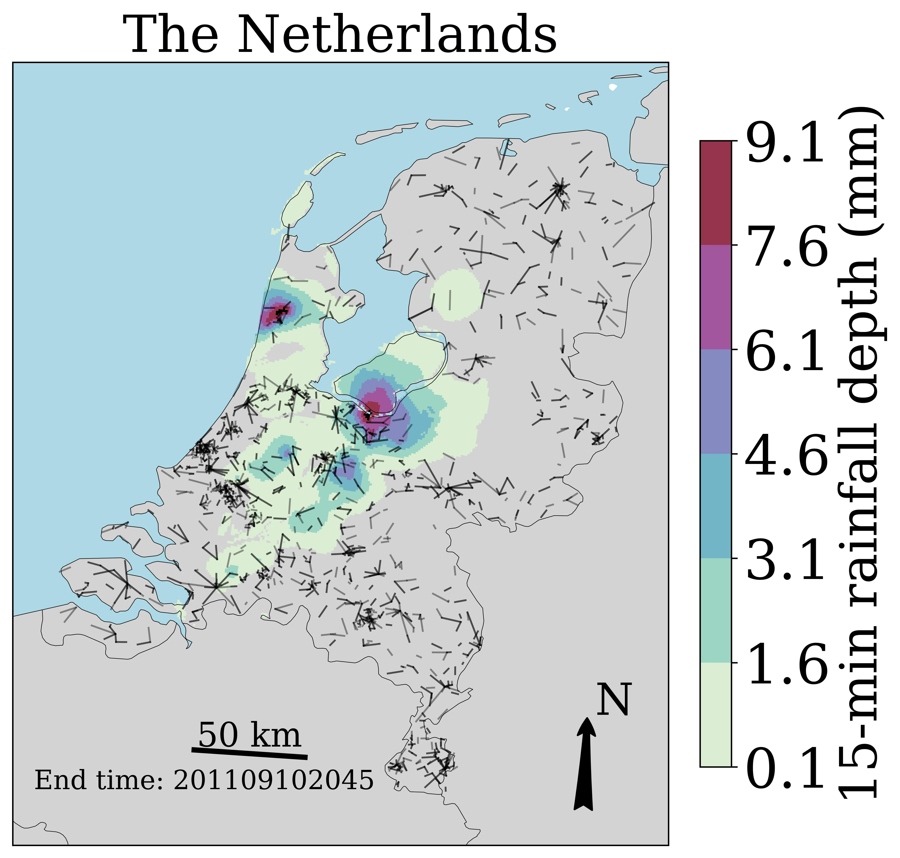

# MapRAINLINK
Python script to visualize rain gauge, radar, and commercial microwave link (CML) locations and their rainfall estimates on a map. This Python script is more widely applicable. It can be used to plot lines and/or points (and their values) on a map, not necessarily CML paths and rain gauge locations, and not necessarily rainfall intensities or accumulations. It can also be used to plot other data fields.

This script is meant as a replacement of the visualization by the open-source R package RAINLINK for Dutch radar data and commercial microwave link data. RAINLINK (https://github.com/overeem11/RAINLINK) is a retrieval algorithm for rainfall mapping from microwave links in a cellular communication network. It works with output data from RAINLINK, irrespective of the RAINLINK version. MapRAINLINK can be of general use for opportunistic sensing data, such as those from CML and personal weather stations (PWS).

More tools for working with OPERA radar data, and the derived climatological dataset EURADCLIM, can be found here: https://github.com/overeem11/EURADCLIM-tools.

How to start? Just clone this repository. With the default settings, the locations of CML paths and the interpolated CML rainfall estimates are plotted on a map of the Netherlands for one 15-min time interval. This is based on output from RAINLINK, by running the Dutch sample dataset, which is part of RAINLINK. The map is made by running:
python VisualizeCMLsGaugesRadars_CartopyOSM_GM.py

Open datasets to use with MapRAINLINK:
- Gridded rainfall maps retrieved from CML data from Sri Lanka over a 3.5 month period (https://doi.org/10.4121/14166539.v2).
- The 2-day sample dataset, which is part of RAINLINK, or the ~4-month dataset covering the Netherlands (https://doi.org/10.4121/uuid:323587ea-82b7-4cff-b123-c660424345e5). These datasets need to be processed with RAINLINK to obtain CML path averages or rainfall fields, which can be plotted with MapRAINLINK.

