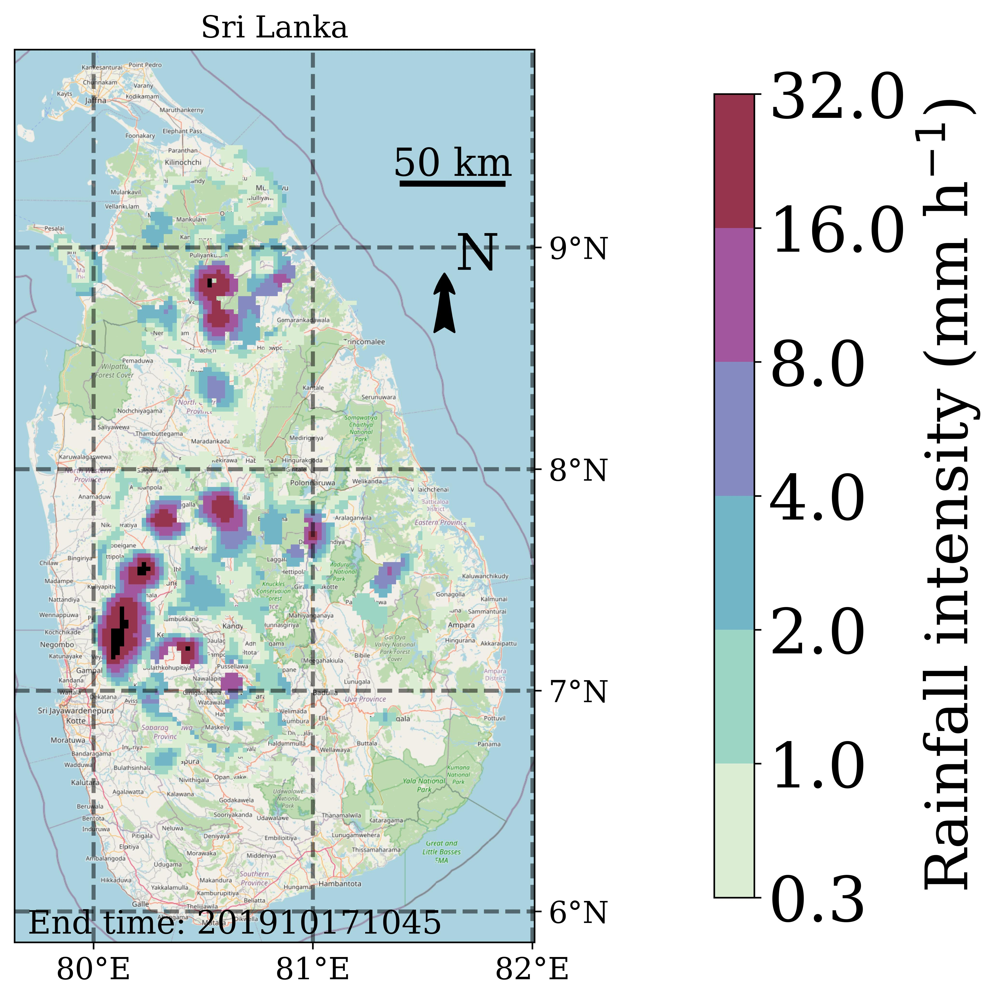

# MapRAINLINK

# Introduction
Python script to visualize rain gauge, radar, and commercial microwave link (CML) locations and their rainfall estimates on a map. This Python script is more widely applicable. It can be used to plot lines and/or points (and their values) on a map, not necessarily CML paths and rain gauge locations, and not necessarily rainfall intensities or accumulations. It can also be used to plot other data fields. The maps are highly customizable. For instance, the background map can be chosen from GoogleMaps, Natural Earth, or OpenStreetMap. Plotting a map typically takes 5 up to 15 seconds.

This script is meant as a replacement of the visualization by the open-source R package RAINLINK for Dutch radar data and commercial microwave link data. RAINLINK (https://github.com/overeem11/RAINLINK) is a retrieval algorithm for rainfall mapping from microwave links in a cellular communication network. MapRAINLINK works with output data from RAINLINK, irrespective of the RAINLINK version. MapRAINLINK can be of general use for opportunistic sensing data, such as those from CML and personal weather stations (PWS). Note that some Python libraries need to be installed: cartopy, copy, h5py, matplotlib, numpy, os, pandas, pyproj, sys.

# How to start?
Just clone this repository or simply copy all files to a local directory. With the default settings, the locations of CML paths and the interpolated CML rainfall estimates are plotted on a map of the Netherlands for one 15-min time interval. The interpolated values have been obtained by running RAINLINK with the Dutch sample dataset, which is part of RAINLINK. The map "Netherlands.jpg" is made by running the vizualisation script "VisualizeCMLsGaugesRadars_CartopyOSM_GM.py" using Python version 3:
```
python VisualizeCMLsGaugesRadars_CartopyOSM_GM.py ConfigVisualizeCMLsGaugesRadars_CartopyOSM_GM.py
```
All the plotting options and input and output files need to be specified in the configuration file "ConfigVisualizeCMLsGaugesRadars_CartopyOSM_GM.py", although it is also possible to provide additional arguments on the command line, which will overrule the settings in the configuration file. When the Python script is ran using the default settings, a CML rainfall map for the Netherlands is visualized for one 15-min time interval, file "Netherlands.jpg". These values are output from RAINLINK and stored in file "linkmap_201109102045.dat". This file has been obtained by running RAINLINK with the 2-day sample dataset from RAINLINK for the Netherlands. These are interpolated values at the middle of the grid cells of the Dutch radar grid ("InterpolationGrid.dat" from https://github.com/overeem11/RAINLINK). In order to plot these, "PlotDataFieldRadarGrid" must be set to "yes" in the configuration file. First, the radar file "RAD_NL25_RAC_MFBS_24H_201805300800_NL.h5" is read, so that the polygons for the plotting can be constructed ("KNMIRadarInputFileName" in the configuration file), where the associated radar values are set to 0 in the Python script. The file "InterpolationGridRowColNrsRadarGrid.dat" ("FileNameRowColNumbersRadarGrid" in the configuration script) is read to obtain the column and row numbers of the radar grid for the CML grid cells. Next, these grid cells are filled with the interpolated CML rainfall values. 

In case path-average rainfall needs to be visualized, the RAINLINK output from file  "linkdata_201109102045.dat" is used, and "PlotCMLTimeInterval" and "PlotValuesCMLPathAverage" must be set to "yes" in the configuration file. "PlotDataField" may be made not equal to "yes" to avoid that the CML rainfall field and CML path averages are plotted together. The file "StationMetadataNetwork1.dat" contains locations of the two C-band ground-based weather radars in the Netherlands. These locations can be visualized by setting "PlotGaugeNetwork1" to "yes" in the configuration file. If also "PlotValuesGaugesNetwork1" is set to "yes", the associated rainfall values are visualized (this is meant as an illustration of plotting rainfall values for gauge locations, the radar itself obviously does not observe point values).

For other regions, "PlotDataFieldRadarGrid" must be made not equal to "yes", and a grid with "fixed changes in degrees", e.g. a 0.02 degree grid in latitude and longitude, must be used (defined by "InterpolationGrid" in the configuration file). Such an interpolation grid can be constructed using the following R scripts and must be used with RAINLINK to obtain the interpolated data at this grid. Next, it can be used to visualize CML rainfall maps. Here, an example is provided for Sri Lanka, which reproduces Figure 5(e) from https://doi.org/10.1088/1748-9326/ac0fa6 (but that was obtained with a different plotting package), the map "SriLanka.jpg" (this can be reproduced by cloning this repository and running the command):
```
python VisualizeCMLsGaugesRadars_CartopyOSM_GM.py ConfigVisualizeCMLsGaugesRadars_CartopyOSM_GM_SriLanka.py
```
A recipe to obtain an interpolation grid for RAINLINK and one for the plotting with "VisualizeCMLsGaugesRadars_CartopyOSM_GM.py" for Sri Lanka is given below:
1. Start R and run this script to obtain the interpolation grid for Sri Lanka: source("MakeInterpolationGridSriLanka.R").
2. The output "InterpolationGrid_SriLanka.dat" has to be used by RAINLINK to obtain interpolated rainfall maps (3.5 months of these rainfall maps can be obtained from https://doi.org/10.4121/14166539.v2). Since the CML data are not publicly available, this step cannot be reproduced.
3. After running RAINLINK, store the following output of RAINLINK in the file "CMLLocations_SriLanka_RmeanAvailable_MinMax.dat", by pasting this in the R shell (again this step cannot be reproduced and the file "CMLLocations_SriLanka_RmeanAvailable_MinMax.dat" is not publicly available because of restrictions for the CML metadata):

Rmean <- RainRetrievalMinMaxRSL(Aa=Aa,alpha=alpha,Data=DataOutlierFiltered,kRPowerLawDataH=kRPowerLawDataH,kRPowerLawDataV=kRPowerLawDataV,PmaxCor=Pcor$PmaxCor,PminCor=Pcor$PminCor,Pref=Pref)

DataOutlierFiltered <- OutlierFilterMinMaxRSL(Data=DataPreprocessed,F=WetDry$F,FilterThreshold=FilterThreshold)

cond <- which(Rmean>=0)

dataf <- unique(data.frame(cbind(DataOutlierFiltered$XStart[cond],DataOutlierFiltered$YStart[cond],DataOutlierFiltered$XEnd[cond],DataOutlierFiltered$YEnd[cond])))

write.table(dataf,"CMLLocations_SriLanka_RmeanAvailable_MinMax.dat",row.names=FALSE,col.names=TRUE,quote=FALSE)

4. Start R and run this script to obtain a grid which can be used for plotting with MapRAINLINK: "MakeInterpolationGridForPlottingSriLankaMinMax.R". Output is the file "CMLInterpolationGridSriLanka.dat", which is the same interpolation grid as provided at https://doi.org/10.4121/14166539.v2. If "GridPlottingCML" is set to "yes", the last column in "CMLInterpolationGridSriLanka.dat" is set to 1 if a grid cell is less than 0.05 degrees from the start and/or end coordinates of a CML. Otherwise, the last column is always set to 1. "VisualizeCMLsGaugesRadars_CartopyOSM_GM.py" only plots the interpolated CML rainfall for values of 1 in the last column.
5. Simply follow the above steps for deriving your own interpolation grids for interpolation with RAINLINK and/or visualization with MapRAINLINK.

Open datasets to use with MapRAINLINK:
- Gridded rainfall maps retrieved from CML data from Sri Lanka over a 3.5 month period (https://doi.org/10.4121/14166539.v2).
- The 2-day sample dataset, which is part of RAINLINK, or the ~4-month dataset covering the Netherlands (https://doi.org/10.4121/uuid:323587ea-82b7-4cff-b123-c660424345e5). These datasets need to be processed with RAINLINK to obtain CML path averages or rainfall fields, which can be plotted with MapRAINLINK.
- 5 minute precipitation accumulations from climatological gauge-adjusted radar dataset for The Netherlands (1 km) in KNMI HDF5 format (https://dataplatform.knmi.nl/dataset/rad-nl25-rac-mfbs-5min-2-0). Can be used as a reference for CML rainfall estimates.
- 1 hour precipitation accumulations from climatological gauge-adjusted radar dataset for The Netherlands (1 km) in KNMI HDF5 format (https://dataplatform.knmi.nl/dataset/rad-nl25-rac-mfbs-01h-2-0). Can be used as a reference for CML rainfall estimates.
- 24 hour precipitation accumulations from climatological gauge-adjusted radar dataset for The Netherlands (1 km) in KNMI HDF5 format (https://dataplatform.knmi.nl/dataset/rad-nl25-rac-mfbs-24h-2-0). Can be used as a reference for CML rainfall estimates. The file "RAD_NL25_RAC_MFBS_24H_201805300800_NL.h5" contains 24-h accumulations for one interval and can be used for testing.

MapRAINLINK can also visualize gridded OPERA radar data in HDF5-ODIM format. Then the file "CoordinatesHDF5ODIMWGS84.dat" is needed. It contains the coordinates of the center of radar grid cells with longitude (first column) and latitude (second column) in degrees (WGS84). More tools for working with OPERA radar data, and the derived climatological dataset EURADCLIM, can be found here: https://github.com/overeem11/EURADCLIM-tools. EURADCLIM is a dataset of 1-h and 24-h precipitation accumulations covering 78% of geographical Europe (https://doi.org/10.21944/7ypj-wn68 & https://doi.org/10.21944/1a54-gg96). The file "RAD_OPERA_24H_RAINFALL_ACCUMULATION_201305311400.h5" contains 24-h accumulations for one interval and can be used for testing.



